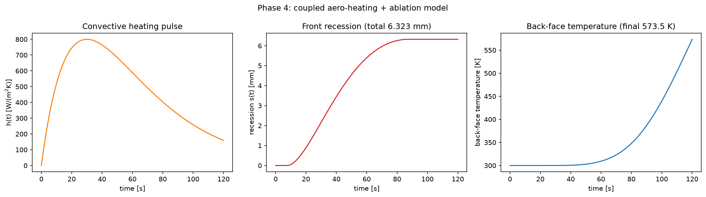
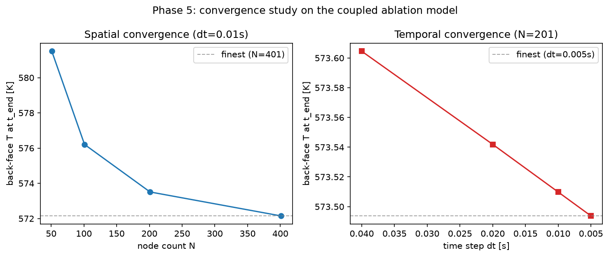
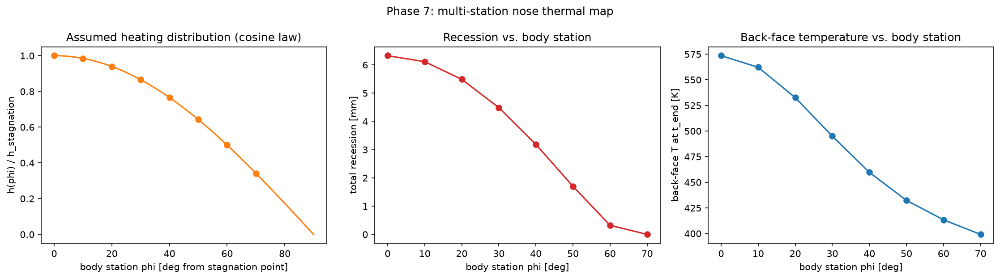
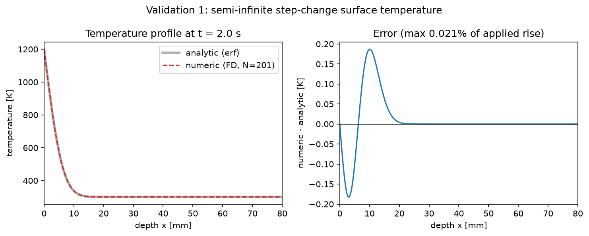
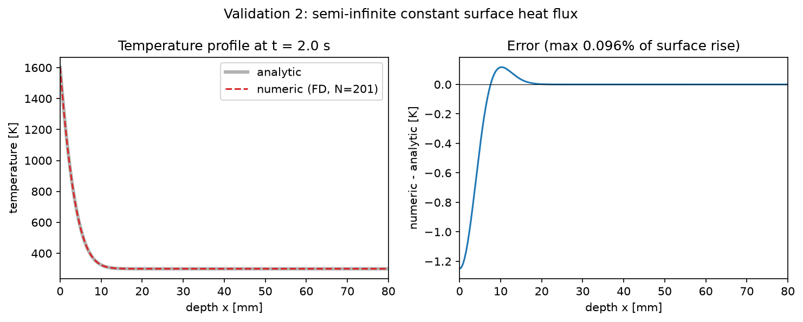
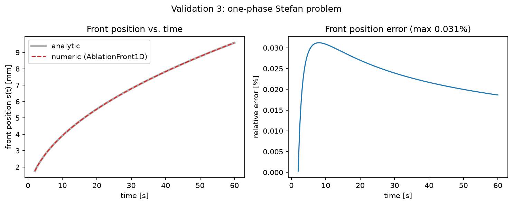
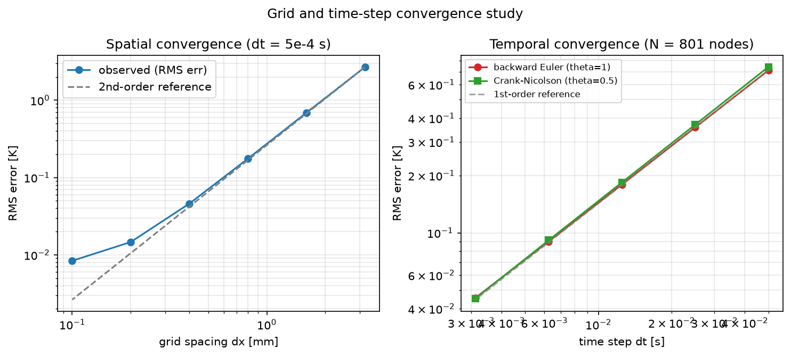

# 1D Transient Heat Conduction and Ablation Model

A 1D transient conduction and ablation solver for a hypersonic vehicle
nose/heat shield, coupling aerodynamic heating, radiative reradiation,
and ablative front recession, with back-face temperature tracked as the
structural survival metric. See
[`docs/PROJECT_PLAN.md`](docs/PROJECT_PLAN.md) for the full phased plan.

## Status

- Core implicit (theta-method) finite-difference solver: **done**
- Dirichlet, flux, and convective+radiative boundary conditions: **done**
- Validation against semi-infinite step-change analytic solution: **done, 0.021% max error**
- Validation against semi-infinite constant-flux analytic solution: **done, 0.096% max error**
- Grid/time-step convergence study (Validations 1-2): **done** (see below)
- Stefan problem (moving-boundary ablation) validation: **done, 0.031% max error in front position**
- Full coupled ablation model + back-face survival tracking: **done** (see below)
- Grid/time-step convergence study on the coupled ablation model: **done, converged to within 0.24% at 201 nodes**
- Multi-station nose thermal map: **done** (see below)
- Trajectory coupling + Monte Carlo: **blocked** — checked the actual 3-DOF
  intercept simulator; its flight regime (Mach ~1-1.3, low-altitude
  terminal intercept) is physically incompatible with hypersonic
  stagnation heating (~2,000-5,000x too slow). See `docs/PROJECT_PLAN.md`
  Phase 6 for the investigation and what would unblock it.

**The core validated model (Phases 0-5) and one of the two stretch
goals (Phase 7) are complete.**

## Getting started

Requires **Python 3.9 or newer**. Everything below works from a fresh clone.

### Windows (PowerShell)

```powershell
# 1. Get the code
git clone https://github.com/AlexF0643/1D-transient-heat-conduction-and-abaltion-model.git
cd 1D-transient-heat-conduction-and-abaltion-model

# 2. Create and activate a virtual environment
python -m venv .venv
.\.venv\Scripts\Activate.ps1

# 3. Install dependencies and the package
pip install -r requirements.txt
pip install -e .

# 4. Launch the interactive app, then open http://127.0.0.1:8000
python app\server.py
```

Notes for PowerShell:

- If `Activate.ps1` is blocked ("running scripts is disabled on this
  system"), run `Set-ExecutionPolicy -Scope CurrentUser RemoteSigned` once
  and activate again.
- If `python` isn't found, use `py` (the Windows launcher) instead, e.g.
  `py -m venv .venv`. Use `python`, not `python3`, on Windows.
- Activate the environment (step 2's second line) again in every new
  PowerShell window before running anything.
- Stop the app with `Ctrl+C`. If port 8000 is taken, pick another:
  `python app\server.py 8080`, then open `http://127.0.0.1:8080`.

### macOS / Linux (bash or zsh)

```bash
git clone https://github.com/AlexF0643/1D-transient-heat-conduction-and-abaltion-model.git
cd 1D-transient-heat-conduction-and-abaltion-model
python3 -m venv .venv
source .venv/bin/activate
pip install -r requirements.txt
pip install -e .
python3 app/server.py          # then open http://127.0.0.1:8000
```

### Using it as a Python library

After `pip install -e .`, the solver can be called from any Python
session or script:

```python
import numpy as np
from heatablate import Material, ConvectiveRadiativeBC, AblationFront1D

mat = Material(k=0.5, rho=1400, cp=1200, emissivity=0.85,
               heat_of_ablation=8e6, ablation_temperature=2200)
bc = ConvectiveRadiativeBC(h=lambda t: 800.0, T_aw=6000.0, emissivity=0.85, T_inf=0.0)
model = AblationFront1D(mat, length=0.018, n_nodes=101, surface_bc=bc)
out = model.solve(np.full(101, 300.0), dt=0.05, t_end=60.0)
print(f"recession {out['s'][-1]*1e3:.2f} mm, back face {out['T_back'][-1]:.0f} K")
```

For a measured diffusivity, build the material with
`Material.from_diffusivity(alpha, k, rho=..., emissivity=..., ...)`. Pass the
real density `rho` whenever ablation is enabled.

## Run the validation scripts and tests

Run from the repository root, with the virtual environment active. On
Windows use `python` and backslashes (`scripts\validate_step_change.py`);
on macOS/Linux use `python3` and forward slashes.

```powershell
python scripts\validate_step_change.py
python scripts\validate_constant_flux.py
python scripts\validate_stefan.py
python scripts\convergence_study.py
python scripts\mission_ablation.py
python scripts\convergence_study_ablation.py   # ~2-3 min, self-convergence sweep
python scripts\multistation_nose_map.py        # ~2 min, 8 stations
python -m pytest tests                          # 28 tests, ~30 s
```

Scripts print their results to the terminal, and the ones that make plots
save PNGs into `figures/`.

## Physics and numerics

Solves `rho*cp * dT/dt = d/dx(k * dT/dx)` on a uniform 1D grid with a
generalized theta-method in time (`theta=1`: backward Euler, `theta=0.5`:
Crank-Nicolson), both unconditionally stable, solved with a hand-written
Thomas (tridiagonal) algorithm. Boundary conditions are pluggable:

- `DirichletBC(T)` — prescribed surface temperature
- `FluxBC(q)` — prescribed heat flux into the domain (used for the
  adiabatic back face and the constant-flux validation)
- `ConvectiveRadiativeBC(h, T_aw, emissivity, T_inf)` — aerodynamic
  convective heating with radiative reradiation,
  `q = h*(T_aw - Ts) - eps*sigma*(Ts^4 - T_inf^4)`, nonlinear in the
  unknown surface temperature `Ts` and closed each step with a Newton
  iteration (flux linearized with the analytic `dq/dTs`). An earlier
  fixed-point (Picard) version diverged on coarse grids; the converged
  answers are identical, and the Newton version is also ~4x faster.

All boundary closures use a ghost-node central difference, so they stay
second-order accurate in space like the interior scheme.

`Material.from_diffusivity(alpha, k, ...)` lets you feed in a *measured*
thermal diffusivity and conductivity directly (rather than re-deriving
`rho*cp` from tabulated density/specific-heat values) — the intended use
case being lab-measured diffusivity and emissivity as direct model
inputs.

`AblationFront1D` (`heatablate/ablation.py`) adds a receding surface on
top of `HeatConduction1D`: once the surface reaches
`material.ablation_temperature`, it's held there and the excess incident
flux (beyond what conducts into the remaining material) drives recession,
absorbing `material.heat_of_ablation` — but only while the incident flux
can actually sustain it (`q_incident >= q_conducted`, checked every
step); once a fading heat pulse can no longer sustain the ablation
temperature, the surface is released and allowed to cool. Implemented as
a moving-mesh (ALE) scheme — the conduction sub-problem is re-solved each
step on the current, shrinking domain, with the temperature field
linearly interpolated onto the new grid after each recession increment.

## Phase 1: validation against a step change in surface temperature

*(Phase 0, the core solver and boundary conditions, is described under
[Physics and numerics](#physics-and-numerics) above.)*

A semi-infinite solid at `T0` has its surface suddenly held at `Ts`. The
closed-form solution is

    T(x,t) = Ts + (T0 - Ts) * erf( x / (2*sqrt(alpha*t)) )

`scripts/validate_step_change.py` runs the `DirichletBC` solver on an 80 mm
slab (alpha = 6e-6 m²/s, k = 1.5 W/(m K), 300 K → 1200 K, t_end = 2 s,
N = 201, dt = 2 ms). The thermal penetration depth `sqrt(alpha*t_end)` is
3.5 mm, far less than the slab length, so the back face never sees the
front and the slab behaves as semi-infinite.

**Result: max error 0.19 K, 0.021% of the 900 K applied step** (the
back-face temperature rise stays at ~1e-12 K, as it should).

## Phase 2: validation against a constant surface heat flux

The same semi-infinite solid, now with a constant flux `q0` applied at
`t = 0`:

    T(x,t) - T0 = (q0/k) * [ 2*sqrt(alpha*t/pi) * exp(-x²/(4*alpha*t))
                             - x * erfc( x / (2*sqrt(alpha*t)) ) ]

This exercises the `FluxBC` ghost-node closure specifically, because the
prescribed quantity is a derivative of the field rather than the field
itself. `scripts/validate_constant_flux.py` uses `q0 = 5e5 W/m²` with the
same material, grid and time step as Phase 1.

**Result: max error 1.25 K, 0.096% of the 1303 K surface temperature rise.**

## Phase 3: validation against the Stefan problem (moving boundary)

The classical one-phase Stefan problem: a semi-infinite solid at the
melt/ablation temperature `Tm` has its surface held at `Ts > Tm`, and a
phase-change front recedes from the surface as

    s(t) = 2 * lambda * sqrt(alpha*t)

where `lambda` is the root of `lambda * exp(lambda²) * erf(lambda) = Ste / sqrt(pi)`
and `Ste = cp*(Ts - Tm) / heat_of_ablation` is the Stefan number.

**Solver (`heatablate/ablation.py`, `AblationFront1D`).** Each step solves
the conduction problem on the current domain `[s(t), length]` with the
existing `HeatConduction1D`, reused unmodified (the diffusion equation is
translation-invariant, so only the domain length matters). Once the
surface reaches `ablation_temperature` it is held there, and the recession
rate comes from a surface energy balance: incident flux in excess of what
conducts into the remaining material becomes recession, absorbing
`heat_of_ablation`:

    ds/dt = max(0, q_incident - q_conducted) / (rho * heat_of_ablation)

The grid is then rebuilt over the shrunken domain and the temperature field
is linearly interpolated onto it (a moving-mesh / ALE scheme). This was
chosen over a boundary-immobilized (Landau-transformed) formulation, which
is a valid but more involved alternative than this project's scope needs.

**Validation strategy.** `scripts/validate_stefan.py` starts the material
uniformly at `Tm` (the classical one-phase idealization) and drives the
front with the *exact* analytic Stefan flux (`stefan_front_flux`). That
isolates the front-tracking and remeshing algorithm from the diffusion
scheme (already validated in Phases 1-2) and from the nonlinear
convective/radiative boundary condition. The run bootstraps from
`t0 = 2 s` (using the analytic front position there) to avoid the
`1/sqrt(t)` flux singularity at `t = 0`.

**Result: max relative error in front position 0.031% over a 60 s run**
(Ste = 0.133, lambda = 0.2527, N = 201, dt = 0.01 s; numeric front
9.589 mm vs. analytic 9.591 mm). The remaining material stays pinned at
`Tm`, matching the one-phase idealization exactly. The physically driven
version of this behavior (surface heating, onset, recession, surface
pinned at `Tm`) is covered in `tests/test_ablation.py`.

See also the [Validation results](#validation-results) table and figures
below.

## Phase 4: coupled ablation model

`scripts/mission_ablation.py` couples `ConvectiveRadiativeBC` to
`AblationFront1D` and runs a representative single-hump reentry heat
pulse through a carbon-phenolic-style ablator (order-of-magnitude
material properties — not a specific measured material; this project's
own measured diffusivity/emissivity would replace these once available):



Ablation onset at t=7.8s, 6.32mm total recession, back-face temperature
rising from 300K to 573K over a 120s mission with ~12mm of material
margin remaining. Recession correctly tracks the heating pulse and
plateaus once the pulse fades past what it can sustain — the surface
then cools back below the ablation temperature rather than staying
artificially clamped there.

**`AblationFront1D.solve()` returns an `energy_balance` diagnostic**
(cumulative incident energy vs. sensible + latent enthalpy accounted
for) specifically to catch silent bugs in the front-recession logic that
"does it run and look plausible" wouldn't. It caught two real ones while
building this phase:

1. A **state-chattering bug**: the ablating/not-ablating decision was
   originally re-derived from a bare `T[0] >= Tm` check every step, but
   post-remeshing interpolation can leave the surface a hair below Tm
   even while ablation is fully sustained — which flipped the algorithm
   back to the unclamped boundary condition on *exactly half* the steps
   in a 3000-step test run, silently skipping the recession update each
   time. Symptom: an ~8% energy-balance residual against an expected
   sub-1%.
2. A **missing exit-from-ablation physics bug**: the first fix (a
   one-way latch) traded the chattering for a different error — under a
   fading heat pulse, it kept forcing the surface to stay at the
   ablation temperature forever, even once incident flux could no longer
   sustain it. Symptom: a **-12.8%** residual on the full mission-pulse
   scenario.

Both are fixed by deciding the ablating state from a genuine per-step
physical sustainability check rather than a temperature re-check (see
`heatablate/ablation.py` module docstring and `docs/PROJECT_PLAN.md`
Phase 4 for the full derivation). After both fixes, the mission-pulse
residual is **-0.23%**, consistent with the remeshing-interpolation
drift alone. Regression tests for both bugs are in
`tests/test_ablation.py`.

**Limiting cases** (see `tests/test_ablation.py`): `ablation_temperature
→ infinity` (never reached) recovers the plain, non-ablating
`HeatConduction1D` + `ConvectiveRadiativeBC` solution exactly. A very
large `heat_of_ablation` instead drives recession to near-zero while the
surface still clamps at the ablation temperature — a different, and
correct, limit (the original plan had this backwards; see
`docs/PROJECT_PLAN.md`).

## Phase 5: convergence on the coupled ablation model

There's no analytic solution for the full coupled model, so
`scripts/convergence_study_ablation.py` runs a self-convergence study on
the Phase 4 mission scenario: back-face temperature at t_end is tracked
across node-count and time-step refinement, and error is measured
against the finest run in each sweep (Richardson-style).



**Back-face temperature converged to within 0.24% at 201 nodes** (vs.
401 nodes: 1.63% → 0.71% → 0.24% → reference — roughly halving each
doubling, consistent with the ALE remeshing's linear interpolation being
the dominant error source, 1st order, rather than the interior
diffusion scheme, 2nd order as shown in Validations 1-2). Time-step
error is negligible by comparison: **within 0.003% at dt=0.01s**, so the
grid — not the time step — is what to refine if tighter accuracy is ever
needed.

## Phase 6: trajectory coupling — investigated, blocked

Before wiring the ablation model to a trajectory source, I pulled and
checked the actual 3-DOF intercept simulator this stretch goal named.
Every one of its 9 preset scenarios launches at 1000m altitude, missile
speed 60 m/s off the rail, target at 250 m/s, closing speeds topping out
around 300-450 m/s (~Mach 1-1.3, per the simulator's own README) — a
low-altitude terminal intercept engagement, not a hypersonic reentry
trajectory. Stagnation heating correlations scale roughly as velocity³,
so feeding this simulator's real output into the model would show
essentially zero heating and no ablation: technically "using the real
trajectory," but a physically empty demonstration.

Rather than silently produce that non-result, or quietly substitute a
synthetic trajectory in its place, this was flagged and deferred —
see `docs/PROJECT_PLAN.md` Phase 6 for the full reasoning and what would
unblock it (a genuinely hypersonic trajectory source, real or a
purpose-built synthetic reentry integrator labeled as such).

## Phase 7: multi-station nose thermal map

`scripts/multistation_nose_map.py` parametrizes a blunted (spherical-cap)
nose by the angle `phi` from the stagnation point and scales the Phase 4
heating pulse at each of 8 stations (0°-70°) by the standard cosine-law
Newtonian-flow approximation `h(phi,t) = h_stagnation(t) * cos(phi)`.
`AblationFront1D` runs independently at each station — no coupling
needed between stations under the thin-boundary-layer assumption that
justifies this whole approach (see `docs/PROJECT_PLAN.md` Phase 7 for
why this, not a full 2D/3D solve, is how heat-shield sizing tools like
NASA's FIAT actually work).



Recession falls from 6.32mm at the stagnation point (phi=0°, exactly
reproducing the Phase 4/5 reference case as a consistency check) to
0.32mm at phi=60°, and stops entirely by phi=70° — the heating there
never reaches the ablation temperature at all. Back-face temperature
falls similarly, 573.5K → 399.2K across the mapped stations. A genuine
spatial thermal map of the nose.

## Validation results

| Check | Metric | Result |
|---|---|---|
| Semi-infinite step surface temperature (erf solution) | max error vs. 900 K applied step | 0.19 K (0.021%) |
| Semi-infinite constant surface flux | max error vs. surface temperature rise | 1.25 K (0.096%) |
| One-phase Stefan problem (moving front) | max relative error in front position s(t) | 0.031% |
| Spatial convergence | observed order (central difference) | ~1.9–2.0 |
| Temporal convergence, backward Euler | observed order | ~1.0 (as expected) |
| Temporal convergence, Crank-Nicolson | observed order | ~1.0, not the textbook 2nd order — see note below |






Each validation script regenerates its figure under `figures/` when run
(`python3 scripts/validate_step_change.py`, etc.) — the PNGs above are
committed so they render directly on GitHub without needing to run
anything.

**Note on the Crank-Nicolson result:** a step-change Dirichlet boundary
condition is non-smooth ("rough") data at `t=0`, a case where
Crank-Nicolson's temporal order is known to degrade (Rannacher, 1984).
This was confirmed directly: prefixing the time march with two
backward-Euler steps before switching to Crank-Nicolson (a standard
"Rannacher startup") drops the error by ~20x at the largest time step
tested. This is now built in: `HeatConduction1D(..., theta=0.5,
rannacher_steps=2)` (measured: ~1.8 order until the spatial-error floor
is hit; 0.74 K -> 0.031 K RMS at dt=0.05 s). The solver defaults to
`theta=1` (backward Euler), which is unaffected by this and is what all
validation runs above use.

**Note on the Stefan validation:** the classical one-phase Stefan
solution assumes the material starts uniformly at the ablation
temperature (no sensible pre-heating ahead of the front), which makes
the remaining-material temperature field trivially uniform by
construction — the meaningful, non-trivial check is the front position
`s(t)` itself, driven by the exact analytic front flux fed in as a
boundary condition. This isolates the front-recession/remeshing
algorithm from the (separately validated) diffusion scheme. See
`docs/PROJECT_PLAN.md` Phase 3 for the full reasoning.

## Interactive browser UI

A local web app for running the ablation model one case at a time, with
your own material values, heating profile and geometry:

```bash
python app/server.py          # PowerShell: python app\server.py
# then open http://127.0.0.1:8000
```

See [Getting started](#getting-started) for setup. Pass a port as the first
argument to change it. It runs the real `AblationFront1D` solver server-side; the page
is plain HTML/JS with no extra dependencies.

- **Inputs:** material as k / density / cp, or as *measured diffusivity* +
  k + density; emissivity; optional ablation temperature and heat of
  ablation; thickness, duration, initial temperature; h(t) as a single
  hump, a constant, or a pasted table of (t, h) pairs; recovery and
  background temperatures.
- **Outputs:** back-face peak vs. your limit (pass/fail), total recession,
  ablation onset, energy-balance residual, plus charts of h(t), recession,
  back-face temperature and the end-of-run temperature profile.
- **Cases:** save runs and overlay up to three saved cases on the same
  charts (saved in the browser); a table view lists every case.
- **Nose map:** optionally run several body stations (cosine-law heating).
- **Resolution:** *Draft / Standard / Fine* set nodes and time step (Fine
  is the validated 201 nodes, dt = 0.02 s, and takes ~3 s per run).
- **Guard rails:** as a safety net, the UI reports non-finite solver
  output as an error and warns when the energy balance is off by more than
  5%, rather than showing untrustworthy numbers. The solver itself warns
  (`RuntimeWarning`) if the surface Newton iteration fails to converge.

## Tests

`tests/test_solver.py`: agreement with both analytic solutions above,
energy conservation on an adiabatic slab, correctness of the
hand-written Thomas solve against a dense linear solve, and steady-state
limits for both Dirichlet and radiative-equilibrium boundary conditions.
`tests/test_app.py` covers the web app's request handling, input
validation, and divergence/energy-balance guards.

`tests/test_ablation.py`: agreement with the Stefan analytic front
position; the remaining material staying pinned at the ablation
temperature in the one-phase idealization; recession rate scaling
inversely with heat of ablation; surface temperature staying near
`ablation_temperature` once receding; a physically-driven run
(convective+radiative heating, non-idealized initial condition) showing
sensible pre-heat → onset → recession behavior; the energy balance
closing to within 1% on that physically-driven run; no state-chattering
under steady heating; recession correctly stopping (and the surface
cooling back below Tm) once a heat pulse fades; and both limiting cases
(`ablation_temperature → infinity` recovers the plain solution exactly;
large `heat_of_ablation` drives recession to near-zero).
